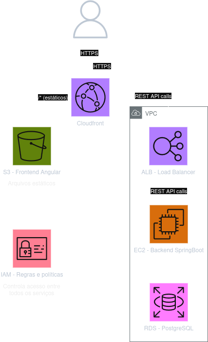

# Arquitetura AWS - SOS Rota

**Projeto:** SOS Rota - Eng5 2026/1  
**Responsável:** Gabriella Pio (GCS / Cloud)  
**IC relacionado:** IC40  
**Última atualização:** 09/06/2026

---

## 1. Visão Geral

O SOS Rota é um sistema de gestão de ocorrências e despacho de ambulâncias, composto por:

- **Backend:** API REST em Java 21 + Spring Boot com autenticação JWT
- **Frontend:** SPA (Single Page Application) em Angular 17+
- **Banco de dados:** H2 em memória no ambiente de desenvolvimento (ver RFC-001) - a arquitetura proposta neste documento representa o ambiente de produção, utilizando Amazon RDS (PostgreSQL) para persistência adequada dos dados

A arquitetura AWS proposta visa suportar a implantação dessa solução em nuvem de forma segura, escalável e com alta disponibilidade, respeitando o modelo de responsabilidade compartilhada da AWS.

---

## 2. Diagrama da Arquitetura

> **Leitura do diagrama:**  
> O usuário acessa o sistema via HTTPS. O **Amazon CloudFront** atua como ponto de entrada global (CDN), distribuindo tanto o frontend (Angular, hospedado no **S3**) quanto as chamadas de API (roteadas para o **Load Balancer**). O ALB distribui as requisições entre as instâncias **EC2** que executam a API Spring Boot. O backend persiste os dados no **Amazon RDS** (PostgreSQL). O **IAM** controla permissões e acessos entre todos os serviços. Todo o ambiente backend fica dentro de uma **VPC privada**.

### 2.1 Fluxo de uma requisição de despacho (RF08)

1. Despachante acessa o frontend Angular via browser
2. Browser faz request HTTPS -> **CloudFront**
3. CloudFront serve os arquivos estáticos do **S3** (HTML/JS/CSS do Angular)
4. Angular renderiza a SPA e faz chamada `POST /api/despachos` com JWT no header
5. Request vai para **CloudFront** -> **ALB** -> **EC2** (instância disponível)
6. Spring Boot valida o JWT (Spring Security), executa o `DijkstraService` e persiste o despacho
7. **EC2** salva o resultado no **RDS** via JDBC
8. Response retorna: EC2 -> ALB -> CloudFront -> Browser

---

## 3. Tabela de Serviços AWS

> Esta arquitetura representa o ambiente de produção proposto. O ambiente de desenvolvimento utiliza H2 em memória conforme documentado na RFC-001.

| #   | Serviço AWS                     | Função no SOS Rota                                                     | Justificativa Técnica                                                                                                                                                                                                                                                                                                                            |
| --- | ------------------------------- | ---------------------------------------------------------------------- | ------------------------------------------------------------------------------------------------------------------------------------------------------------------------------------------------------------------------------------------------------------------------------------------------------------------------------------------------ |
| 1   | **Amazon EC2**                  | Hospeda a API REST do Spring Boot (Java 21)                            | O Spring Boot é uma aplicação Java que requer um servidor de aplicação com JVM. O EC2 fornece instâncias de máquinas virtuais configuráveis (t3.small recomendado), permitindo instalar o JDK 21, executar o JAR do Maven e configurar variáveis de ambiente de forma segura. É a escolha mais direta para aplicações Java não containerizadas.  |
| 2   | **Amazon RDS (PostgreSQL)**     | Banco de dados relacional gerenciado para persistência em produção     | O projeto usa JPA/Hibernate com Spring Data, naturalmente compatível com bancos relacionais. O RDS gerencia automaticamente backups, patches, failover e réplicas de leitura - eliminando overhead operacional. PostgreSQL foi escolhido por ser open-source, robusto e totalmente compatível com o Hibernate.                                   |
| 3   | **Amazon S3**                   | Hospeda os arquivos estáticos do build Angular (HTML, CSS, JS, assets) | Após `ng build`, o Angular gera arquivos estáticos que não precisam de servidor de aplicação. O S3 com Static Website Hosting é a solução de menor custo e maior simplicidade: altamente disponível, sem necessidade de EC2 para o frontend, e integra nativamente com o CloudFront.                                                             |
| 4   | **Amazon CloudFront**           | CDN - ponto de entrada HTTPS para frontend e API                       | O CloudFront distribui o conteúdo do S3 globalmente com baixa latência e adiciona HTTPS com certificado SSL/TLS via ACM. Também roteia requisições de API (`/api/*`) para o Load Balancer, centralizando o ponto de entrada. Protege o S3 de acesso público direto via OAI (Origin Access Identity).                                             |
| 5   | **Elastic Load Balancer (ALB)** | Distribui requisições HTTP entre as instâncias EC2 do backend          | O Application Load Balancer (camada 7) realiza o balanceamento de carga entre múltiplas instâncias EC2. Essencial para: (a) escalabilidade horizontal; (b) health checks - remove instâncias não saudáveis do pool; (c) SSL termination - descriptografa HTTPS antes de repassar ao EC2.                                                         |
| 6   | **AWS IAM**                     | Gerencia identidades, roles e políticas de acesso entre os serviços    | Toda comunicação entre serviços AWS deve ser autenticada. O IAM define: (a) Role da instância EC2 - permite que o backend acesse o RDS sem hardcodar credenciais; (b) políticas de acesso do S3 - restringe acesso ao bucket apenas via CloudFront; (c) usuários de deploy para o CI/CD (GitHub Actions). Segue o princípio do menor privilégio. |
| 7   | **Amazon VPC**                  | Rede privada virtual que isola o ambiente backend da internet pública  | O ALB, as instâncias EC2 e o RDS ficam dentro de uma VPC com sub-redes públicas e privadas. O RDS fica em sub-rede privada (sem acesso direto da internet), acessível apenas pelas instâncias EC2. Security Groups controlam quais portas e origens podem se comunicar.                                                                          |

---

## 4. Decisões Arquiteturais

| Decisão                         | Alternativa considerada           | Justificativa da escolha                                                                                                                                                                                        |
| ------------------------------- | --------------------------------- | --------------------------------------------------------------------------------------------------------------------------------------------------------------------------------------------------------------- |
| EC2                             | ECS com Docker                    | EC2 foi escolhido por simplicidade - o projeto já tem um JAR executável e o grupo não possui configuração Docker definitiva para produção. ECS seria preferível em projetos com maior maturidade em containers. |
| RDS (PostgreSQL)                | DynamoDB (NoSQL)                  | O Spring Data JPA/Hibernate é naturalmente relacional. O modelo de dados tem relacionamentos complexos (FK, JOINs) que são mais eficientes em banco relacional.                                                 |
| S3 + CloudFront                 | Servir o Angular de dentro do EC2 | Separar frontend (S3) de backend (EC2) reduz custo, melhora desempenho e simplifica o deploy: o CI pode fazer `aws s3 sync` após `ng build` sem tocar nas instâncias EC2.                                       |
| ALB (Application Load Balancer) | NLB (Network Load Balancer)       | O ALB opera na camada 7 (HTTP/HTTPS), permitindo roteamento baseado em path (`/api/*` vs `/*`) e configuração de regras por header - essencial para separar o tráfego de API do frontend.                       |

---

## 5. Configurações de Segurança

| Componente | Configuração de segurança                                                                               |
| ---------- | ------------------------------------------------------------------------------------------------------- |
| CloudFront | HTTPS obrigatório (redirect HTTP -> HTTPS), OAI para S3                                                 |
| S3         | Bucket privado - acesso apenas via CloudFront OAI                                                       |
| ALB        | Security Group: aceita apenas tráfego do CloudFront (porta 80)                                          |
| EC2        | Security Group: aceita apenas tráfego do ALB (porta 8080)                                               |
| RDS        | Security Group: aceita apenas tráfego das instâncias EC2 (porta 5432), em sub-rede privada              |
| IAM        | Roles com menor privilégio - EC2 role permite apenas leitura de Secrets Manager para credenciais do RDS |
| JWT        | Tokens assinados com chave secreta (Spring Security + JJWT)                                             |

---

## 6. Estimativa de Instâncias (Ambiente Acadêmico)

> Para fins de demonstração e entrega do PI, consideramos os tamanhos abaixo suficientes e econômicos.

| Serviço    | Configuração sugerida          | Observação                                                  |
| ---------- | ------------------------------ | ----------------------------------------------------------- |
| EC2        | t3.small (2 vCPU, 2 GB RAM)    | Suficiente para JVM + Spring Boot com carga de demonstração |
| RDS        | db.t3.micro (1 vCPU, 1 GB RAM) | PostgreSQL 15, Single-AZ (sem Multi-AZ para reduzir custo)  |
| S3         | Bucket padrão                  | Custo praticamente zero para arquivos estáticos (< 50 MB)   |
| CloudFront | Distribution padrão            | Free tier cobre 1 TB de transferência/mês                   |
| ALB        | 1 ALB padrão                   | Incluso no Free Tier por 12 meses (750 h/mês)               |

---

## Histórico de revisões

| Versão | Data       | Alteração                                     | Autor     |
| ------ | ---------- | --------------------------------------------- | --------- |
| 1.0    | 09/06/2026 | Criação do documento - arquitetura e diagrama | Gabriella |
